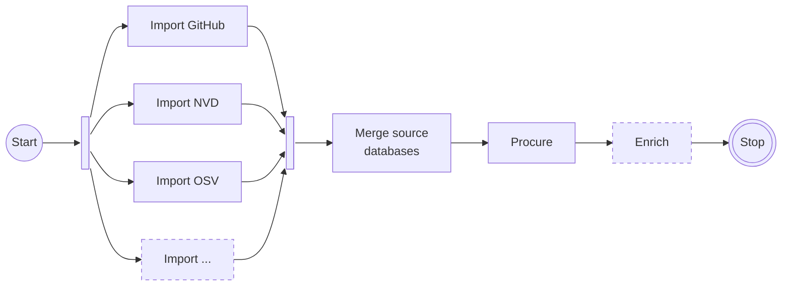
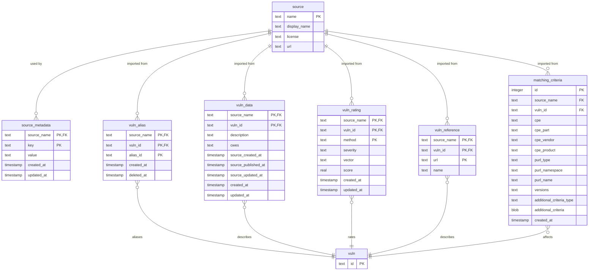

# vuln-db

[](http://www.apache.org/licenses/LICENSE-2.0.html)

Proof of concept for OWASP Dependency-Track's own, centralized vulnerability database.

Refer to https://github.com/DependencyTrack/dependency-track/issues/4122 for details.

## Concept



## Usage

### Importing

```shell
docker run -it --rm \
  -e 'GITHUB_TOKEN=<your_github_token>' \
  -e 'NVD_TOKEN=<your_nvd_token>' \
  -v "$(pwd):/workspace" \
  -w '/workspace' \
  ghcr.io/dependencytrack/vuln-db:snapshot \
  import github nvd osv
```

This will populate the following database files in parallel:

* `github.sqlite`
* `nvd.sqlite`
* `osv.sqlite`

### Merging

```shell
docker run -it --rm \
  -v "$(pwd):/workspace" \
  -w '/workspace' \
  ghcr.io/dependencytrack/vuln-db:snapshot \
  merge --output=all.sqlite github.sqlite nvd.sqlite osv.sqlite
```

### Scanning

> [!WARNING]
> Not fully implemented, don't expect useful results yet.

To get a rough idea of the data quality in a database, it can be leveraged
to scan a CycloneDX Bill of Materials. The implementation of this command
is also intended to showcase how matching logic may work.

```shell
docker run -it --rm \
  -v "$(pwd):/workspace" \
  -w '/workspace' \
  ghcr.io/dependencytrack/vuln-db:snapshot \
  scan --database=all.sqlite bom.json
```

## Data model

The following describes the current data model for source databases.  
The model of the database that eventually is distributed to Dependency-Track instances will likely differ.

> [!WARNING]
> The model is experimental and may change frequently. Please let us know if you have suggestions to improve it.

A primary concern of the model is to track what data point was reported by which source.  
We can only make educated decisions as to which source to trust, or what data to prioritize, if we have a complete picture.



The complete SQLite schema is located [here](src/main/resources/schema.sql).

## Extending

### Sources

New sources can be added by implementing the 
[`Importer`](src/main/java/org/dependencytrack/vulndb/api/Importer.java)
interface, and registering the implementation with Java's
[`ServiceLoader` mechanism](src/main/resources/META-INF/services/org.dependencytrack.vulndb.api.Importer).

`Importer`s are given access to a `Database` object which can be used to store and retrieve source metadata,
as well as storing `Vulnerability` records. An `Importer`'s only responsibility is to retrieve data from upstream
sources, and transform it into the internal data model.

## Research

The database(s) may be used to conduct research on the data across multiple sources.
Gathered insights will help to drive decisions for procurement and enrichment.

Snapshot builds are published to the GitHub Container Registry, both for each source
individually, and all sourced merged into one.

They can be downloaded using [`oras`](https://oras.land/docs/installation), 
and decompressed using [`zstd`](https://github.com/facebook/zstd):

```shell
oras pull ghcr.io/dependencytrack/vuln-db/source/all:snapshot
zstd --decompress --rm all.sqlite.zst
```

The full list of available artifacts can be found [here](https://github.com/DependencyTrack?tab=packages&repo_name=vuln-db).

SQLite databases can be opened in any common database tool, for example [DBeaver](https://dbeaver.io/)
or [DB Browser for SQLite](https://sqlitebrowser.org/).

For more complex queries, [DuckDB](https://duckdb.org/) is worth using.  
It has a [SQLite extension](https://duckdb.org/docs/extensions/sqlite.html) that is trivially enabled:

```shell
duckdb -c 'install sqlite'
duckdb all.sqlite
```

### Open questions

A few questions that could be answered using the data at hand:

- [ ] Is it possible to *reliably* group vulnerabilities by their alias relationship?
    * Do sources report the same data across aliases, or do they have conflicting information?
    * If the information is conflicting, which sources are *correct*?
    * Are alias relationships truly transitive, or not reliable at all?
- [ ] Given one or more ratings for a vulnerability across multiple sources, how do we pick the *best*?
    * If there is no way to determine the best, how can we *deterministically* pick one?
    * Consider the current NVD scenario, where the NVD is authoritative source for CVEs,
      but is severely lagging behind in rating them.
- [ ] Is there data in any of the sources that we will need, but the data model doesn't accommodate for it?
- [ ] Are there sources that are faster to add new vulnerabilities than others?
- [ ] Are there sources that provide more complete information than others?
- [ ] Are there sources that generally provide bad data and should *not* be included?

### Example: Aliases

To find the aliases of all CVEs, and which source reported them:

```sql
with cve_aliases as(
  select vuln_id
       , alias_id
       , source_name
  from vuln_alias
  where vuln_id like 'CVE-%'
  union
  select alias_id as vuln_id
       , vuln_id as alias_id
       , source_name
  from vuln_alias
  where alias_id like 'CVE-%'
)
select vuln_id
     , json_group_array(json_object(source_name, alias_id)) as aliases
from cve_aliases
group by vuln_id
order by vuln_id desc
limit 10
```

Example output:

| vuln\_id       | aliases                                                                                          |
|:---------------|:-------------------------------------------------------------------------------------------------|
| CVE-2025-24898 | `[{"github":"GHSA-rpmj-rpgj-qmpm"}]`                                                             |
| CVE-2025-24884 | `[{"github":"GHSA-hcr5-wv4p-h2g2"},{"osv":"GHSA-hcr5-wv4p-h2g2"}]`                               |
| CVE-2025-24883 | `[{"github":"GHSA-q26p-9cq4-7fc2"},{"osv":"GHSA-q26p-9cq4-7fc2"}]`                               |
| CVE-2025-24882 | `[{"github":"GHSA-qv35-3gw6-8q4j"},{"osv":"GHSA-qv35-3gw6-8q4j"},{"osv":"GO-2024-3038"}]`        |
| CVE-2025-24856 | `[{"github":"GHSA-hj78-p4h7-m5fv"}]`                                                             |
| CVE-2025-24814 | `[{"osv":"BIT-solr-2025-24814"},{"github":"GHSA-68r2-fwcg-qpm8"},{"osv":"GHSA-68r2-fwcg-qpm8"}]` |
| CVE-2025-24802 | `[{"github":"GHSA-hj49-h7fq-px5h"}]`                                                             |
| CVE-2025-24800 | `[{"github":"GHSA-wwx5-gpgr-vxr7"}]`                                                             |
| CVE-2025-24795 | `[{"github":"GHSA-r2x6-cjg7-8r43"}]`                                                             |
| CVE-2025-24794 | `[{"github":"GHSA-m4f6-vcj4-w5mx"}]`                                                             |


This data could be used to calculate confidences for alias relationships,
i.e. the more sources report it the higher the confidence.

### Example: Withdrawal across aliases

Vulnerabilities can be withdrawn or rejected. Taking aliases into consideration,
is withdrawal consistently declared in all sources?

```sql
with
rejected_vulns as(
  select vuln_id
       , source_name
       , source_rejected_at
    from vuln_data
   where source_rejected_at is not null
),
rejected_vuln_aliases as(
  select vuln_id
       , alias_id
    from vuln_alias
   where vuln_id in (select vuln_id from rejected_vulns)
),
rejected_aliases as(
  select vuln_data.vuln_id as vuln_id
       , rejected_vuln_aliases.vuln_id as aliased_vuln_id
       , source_name
       , source_rejected_at
    from vuln_data
   inner join rejected_vuln_aliases
      on rejected_vuln_aliases.alias_id = vuln_data.vuln_id
)
select vuln_id
     , null as alias_id
     , source_name
     , source_rejected_at
  from rejected_vulns
 where vuln_id in (select aliased_vuln_id from rejected_aliases)
 union all
select aliased_vuln_id as vuln_id
     , vuln_id as alias_id
     , source_name
     , source_rejected_at
  from rejected_aliases
 order by vuln_id, alias_id nulls first
```

Example output:

| vuln\_id       | alias\_id           | source\_name | source\_rejected\_at |
|:---------------|:--------------------|:-------------|:---------------------|
| CVE-2018-1103  | null                | osv          | 1715751224000        |
| CVE-2018-1103  | GHSA-w55j-f7vx-6q37 | github       | null                 |
| CVE-2018-1103  | GHSA-w55j-f7vx-6q37 | osv          | null                 |
| CVE-2018-1103  | GO-2020-0026        | osv          | null                 |
| CVE-2018-11087 | null                | osv          | 1715751224000        |
| CVE-2018-11087 | GHSA-w4g2-9hj6-5472 | github       | null                 |
| CVE-2018-11087 | GHSA-w4g2-9hj6-5472 | osv          | null                 |

In the above output `CVE-2018-1103` and `CVE-2018-11087` are both declared as withdrawn
by OSV, but none of their respective aliases are, even if they originate from the same source (OSV).